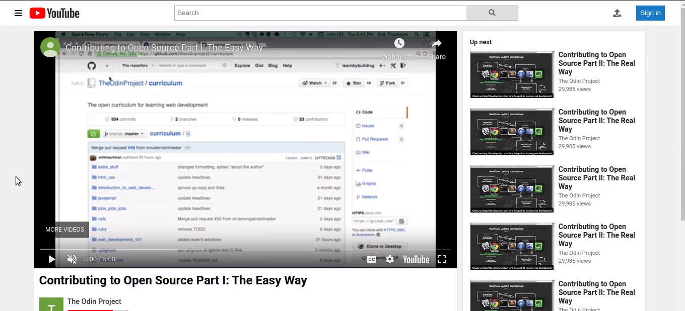

# Youtube Clone

> This is a YouTube clone for the Basic HTML structure project based on the archive link provided.

- Archive: http://archive.ph/Bss88

## Built With

- HTML5, CSS3
- Flexbox

## Live Demo

[Live Demo Link](https://flpfar.github.io/youtube-clone/)

## Authors

👤 **Author1**

- Github: [@flpfar](https://github.com/flpfar)
- Twitter: [@flpfar](https://twitter.com/flpfar)
- Linkedin: [linkedin](https://www.linkedin.com/in/felipe-augusto-rosa-7b96a4b1)

👤 **Author2**

- Github: [@sebGilR](https://github.com/sebGilR)
- Twitter: [@sebGilR](https://twitter.com/sebGilR)
- Linkedin: [sebastianGilRodriguez](https://www.linkedin.com/in/sebastianGilRodriguez)

## 🤝 Contributing

Contributions, issues and feature requests are welcome!

Feel free to check the [issues page](issues/).

## Show your support

Give a ⭐️ if you like this project!

## Acknowledgments

- https://flaviocopes.com published code snippet for responsive YouTube player.
